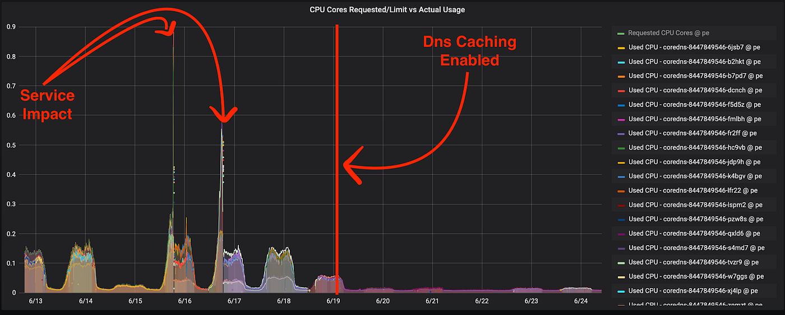
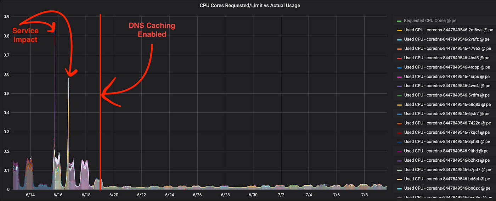
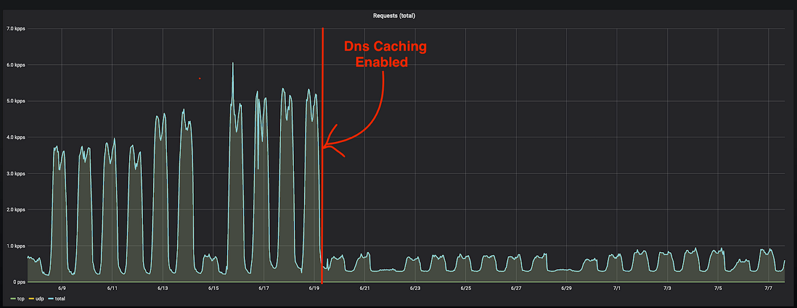
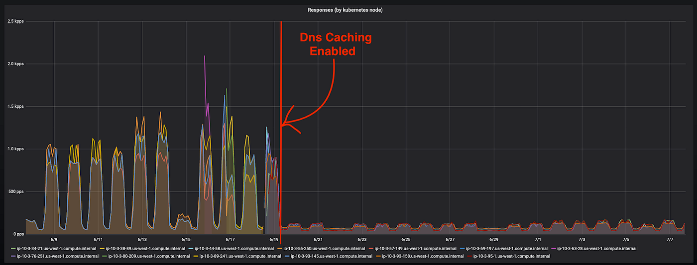

### **DNS Caching for Kubernetes**

Or, how we managed to rescue our monolith Kubernetes deployment\.


### Introduction

As described in the post [An Elasticache Migration Story](https://build.thebeat.co/an-elasticache-migration-story-9090a524b3f8) , at [Beat](https://thebeat.co/en/about-us/?intl=1) our product consists of a legacy monolith — constantly being reduced in size & functionality — and an increasing number of microservices\.

Our microservices run on several Kubernetes clusters\. In contrast, the monolith component is a workload that runs into AWS Opsworks using beefy AWS Instances\. As the monolith is being slowly and constantly carved off using the Strangler pattern, we made the decision to migrate what’s left of it to Kubernetes\.

Quickly summarizing the reasoning behind this:
- **Better Autoscaling Control\.** Pods are easier and faster to spawn, than AWS instances\.
- **Unify our deployment pipelines** \. Deploy everything to Kubernetes from microservices to our monolith\.
- **Improve our prod/stage/dev environment parity** , by having a common way to configure and deploy all our services\.
- **Give more autonomy to our dev teams** \. With our previous setup, 3rd party software, libraries and configuration for our monolith were managed by the infrastructure teams\. Kubernetes allow everything to be included in the monolith repo, packaged in helm charts and controlled by the development teams\.
- **Improve app reliability** , by exploiting Kubernetes deployment strategies and liveness/readiness probes\.


You can read our latest blog post [Preparing before the storm: Migrating our monolith into Kubernetes](https://build.thebeat.co/preparing-before-the-storm-migrating-our-monolith-into-kubernetes-581611c10ae6) describing the effort put into this migration\.
### **The Timing**

With curfews imposed into several of the Beat operating markets due to COVID\-19 pandemic, we were having less traffic reaching the monolith, thus the migration would be easy to handle and the blast radius small to control\.


> “Every crisis contains the seeds of opportunity” 


The timing was right\. However, we’d be in for a surprise…
### The Problem

**TL;DR: _“It’s ALWAYS DNS…”_**

At first, everything seemed right\. We’ve managed to serve approximately 50% of the traffic with latency even lower than the OpsWorks instances monolith deployment\. Awesome\!

But as traffic started to gradually increase, we have been witnessing intermediate DNS resolution failures across the whole k8s cluster\. Things quickly took a turn to the worst, with Service Discovery completely failing for k8s clusters\.
#### **_Interested in solving challenging Engineering problems? [Check out our job openings at Beat](https://thebeat.co/en/careers/?intl=1) \._**
### The Culprit

It did not take us long to identify the culprit\. Now having our monolith running at Kubernetes was putting extensive load into the CoreDNS service\.

Here is a snapshot of the distribution of DNS Requests, as generated from one monolith pod in the course of 2 minutes\. TCPdump \(or better UDPdump …\) to the rescue\! :
```
2810 A? db-monolith-reader.beat.monolith.svc.cluster.local.
2810 A? db-monolith-reader.beat.svc.cluster.local.
2282 A? db-monolith-reader.beat.cluster.local.
2282 A? db-monolith-reader.beat.eu-west-1.compute.internal.
2282 A? db-monolith-reader.beat.
2799 A? kafka.beat.monolith.svc.cluster.local.
2295 A? kafka.beat.svc.cluster.local.
2295 A? kafka.beat.cluster.local.
2295 A? kafka.beat.eu-west-1.compute.internal.
2294 A? kafka.beat.
[...]
```

We were witnessing almost 40K DNS requests in 2 minutes\. **Those are ~20K DNS requests per minute generated from one pod\.**

Our projections predict the monolith k8s deployment **scaling up to 300 pods at full load** in each market\. Thus resulting in **~6Million DNS Requests per minute** hitting each Market’s k8s CoreDNS service\!


It was obvious that this would be nearly impossible to scale\.
### It’s not a Perfect World, but I’ll Take It

Bringing this to the attention of the backend engineers who maintain the monolith, it proved to be a multifront problem quite challenging to be tackled quickly and efficiently\.

Given the constraints of time and complexity, we’ve decided to tackle the problem from the infrastructure side to maintain our reliability\.
### Phase 1 — The Ndots problem

As our monolith did a lot of external traffic, for each connection established \(or more specifically, for each name resolved\) there were 5 DNS queries before the name was correctly resolved\. This happens because it first goes through the 4 local search domains, and then actually issues an absolute name resolution query\.

Let’s bring up the previous tcpdump, to illustrate this:
```
1) 2282 A? db-monolith-reader.beat.monolith.svc.cluster.local.
2) 2282 A? db-monolith-reader.beat.svc.cluster.local.
3) 2282 A? db-monolith-reader.beat.cluster.local.
4) 2282 A? db-monolith-reader.beat.eu-west-1.compute.internal.
5) 2282 A? db-monolith-reader.beat. 
```

This behavior is thoroughly explained by Marco Pracucci in the blogpost [The k8s ndots problem](https://pracucci.com/kubernetes-dns-resolution-ndots-options-and-why-it-may-affect-application-performances.html) \.

By enabling ndots:1 we have managed to reduce the DNS requests to almost a quarter \(¼\) \.

Distribution of requests in the course of 2 minutes\.
```
2519 A? db-monolith-reader.beat.
2512 A? kafka-monolith.beat.
[...]
```

**Summing up to ~10K Requests in 2 mins\. That is a 75% Decrease\!**

That bought us time, as we alleviated a considerable amount of load from the CoreDNS service, but did not completely tackle our problem\.

We needed something drastic\.
### Phase 2 — Introducing Dns Caching

There are a lot of DNS\-Caching solutions floating around\. There are also cloud native ones, like k8s [NodeLocal cache](https://kubernetes.io/docs/tasks/administer-cluster/nodelocaldns) \.

Unfortunately, at the time Kubernetes 1\.18 — introducing stable [nodelocaldns](https://kubernetes.io/docs/tasks/administer-cluster/nodelocaldns) — did not make it to the stable KOPS codebase\. Moreover, this would require changes globally for the Kubernetes clusters, something that we wanted to avoid\.

We have decided to move on with a battle\-tested Dns Caching Solution: “Unbound”

What is Unbound? Quoting from [nlnetlabs\.nl](https://nlnetlabs.nl/projects/unbound/about/) :


> Unbound is a validating, recursive, caching DNS resolver\. It is designed to be fast and lean and incorporates modern features based on open standards\. Late 2019, Unbound has been [rigorously audited](https://ostif.org/our-audit-of-unbound-dns-by-x41-d-sec-full-results/) , which means that the code base is more resilient than ever\. 


Written in C, performant, and low in resource usage, What’s not to like? Let’s test this bad boy\.

Initial tests were performed on a single monolith pod\. By installing unbound locally, and manually editing /etc/resolv\.conf to point to the local dns cache \(unbound\) \.

The results were overwhelming\.

Distribution of DNS Requests, as generated from one monolith pod in the course of 2 minutes, with unbound local cache enabled, and ndots:1 :
```
24 A? db-monolith-reader.beat.
23 A? kafka-monolith.beat.
[...]
```

Summing up to a total ~500 DNS Requests in 2 mins\.
- Compared to the ndots:1 configuration \(Phase 1\), that is a ~ **95% decrease\.**
- Compared to what we begun with \(Phase 0\), that is a **~99% decrease\!**


Moving forward, we are introducing Unbound, acting as a DNS Caching Layer, into the monolith’s deployment\.
#### Unbound Configmap:
```
Configmap:
apiVersion: v1
data:
  unbound.conf: "
server:
  directory: \"/opt/unbound/etc/unbound/\"
  port:53
  interface: 127.0.0.1
  harden-dnssec-stripped: no
  so-reuseport: yes
  cache-min-ttl: 1
  prefetch: yes
  disable-dnssec-lame-check: yes
  minimal-responses: yes
  serve-expired: yes
  access-control: 127.0.0.1/32
forward-zone:
  name: .
  forward-addr: 100.64.0.10@53
"
kind: ConfigMap
metadata:
 name: monolith-dns-cache-conf
 namespace: monolith
```

A pretty straightforward [Unbound Configuration](https://nlnetlabs.nl/documentation/unbound/unbound.conf/) , setting up the DNS Forwarder to the Service IP of ClusterDNS Service\(CoreDNS\) \. Since CoreDNS does not support DNSSEC, we need to define: **“harden\-dnssec\-stripped: no”**
#### Unbound sidecar:

Adding the unbound container, as part of the monolith’s deployment
```
spec:
      containers:
      - image: beat/unbound:1.9.5
        imagePullPolicy: IfNotPresent
        name: dns-local-cache
        ports:
        - containerPort: 53
          name: dns-udp
          protocol: UDP
        - containerPort: 53
          name: dns-tcp
          protocol: TCP
        resources:
          requests:
            cpu: 50m
            memory: 64Mi
        volumeMounts:
        - mountPath: /etc/unbound/unbound.conf
          name: unbound-conf
          readOnly: true
          subPath: unbound.conf
```
#### DnsPolicy:

Lastly, we are overwriting the dnsConfig, configuring the nameserver to localhost\.
```
spec:  
  containers:
  dnsPolicy: None
  dnsConfig:
    nameservers:
    - 127.0.0.1    
    options:
    - name: ndots
    value: "1"
    searches:
    - monolith.svc.cluster.local
```

CoreDNS deployment CPU Usage:








Last 30 Days requests count as reported from CoreDNS:







### Boiling it down

Deploying legacy workloads into Kubernetes can be challenging to scale\. We have seen how we have managed to tackle one of the main scaling bottlenecks in our monolith k8s deployment by introducing Unbound Sidecar, as a DNS Caching Layer\.

Down the line, we will be evaluating [NodeLocal DNSCache](https://kubernetes.io/docs/tasks/administer-cluster/nodelocaldns/) as it made GA in Kubernetes version 1\.18, for a cloud native replacement to Unbound\. This approach requires zero changes introduced to pods\.

Hope you’ve found this read interesting\. Feel free to use the response section below to share your own experiences managing legacy workloads in k8s, and/or issues with DNS in Kubernetes\.

Does Software Engineering at Beat sounds like an exciting journey? It is\. Check out our [open roles](https://thebeat.co/en/careers/?intl=1&team=engineering) to join us on the ride\.

[_Akis Mazioti_](https://medium.com/@a.maziotis) _s is a DevOps Engineer and a member of the DevOps Group at Beat\. He is excited about computer networks and enthusiastic in scaling complex workloads efficiently and reliably\._


_[Post](https://build.thebeat.co/dns-caching-for-kubernetes-fdd89c38c095) converted from Medium by [ZMediumToMarkdown](https://github.com/ZhgChgLi/ZMediumToMarkdown)._
